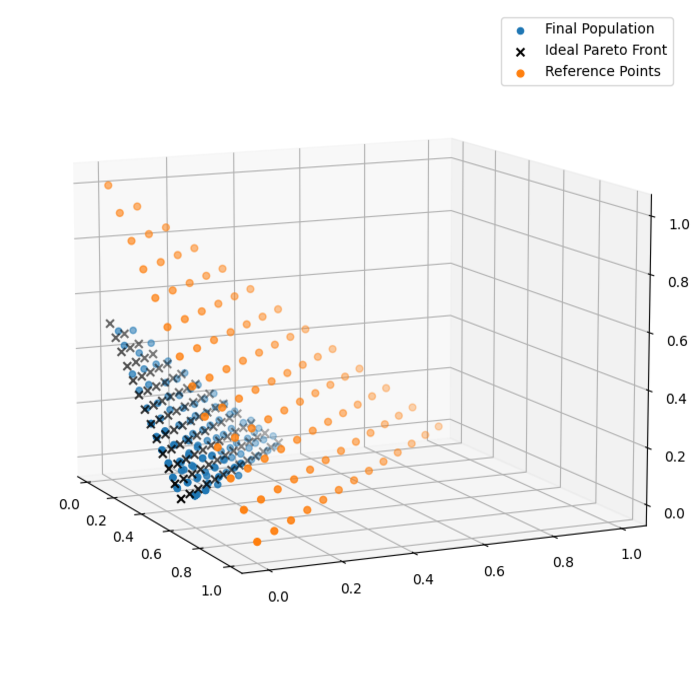
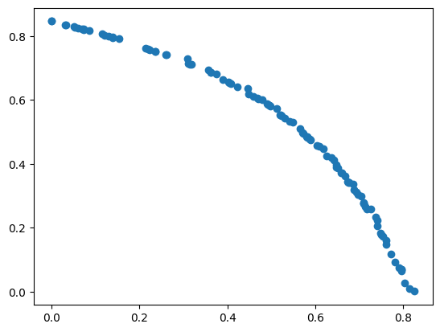
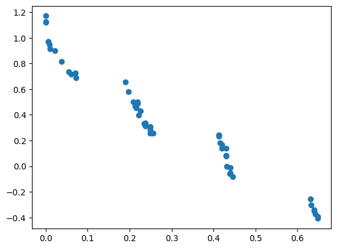
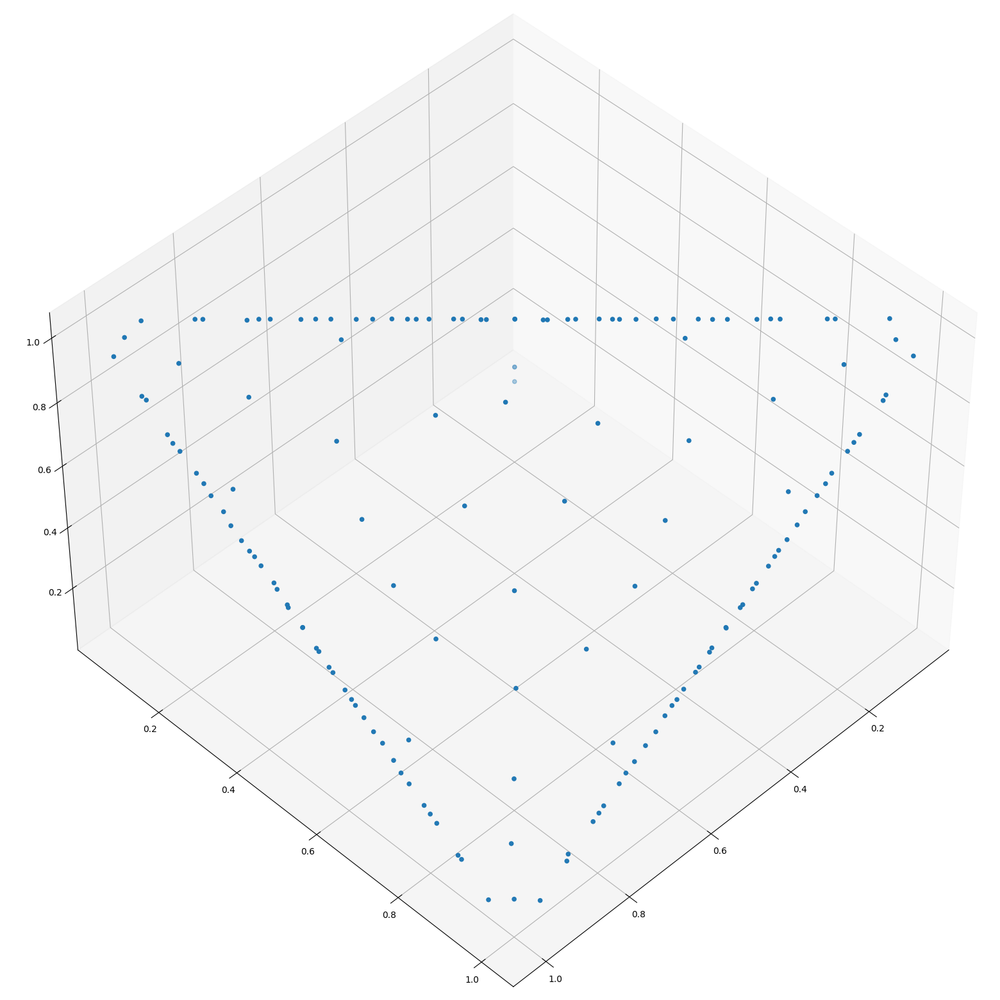
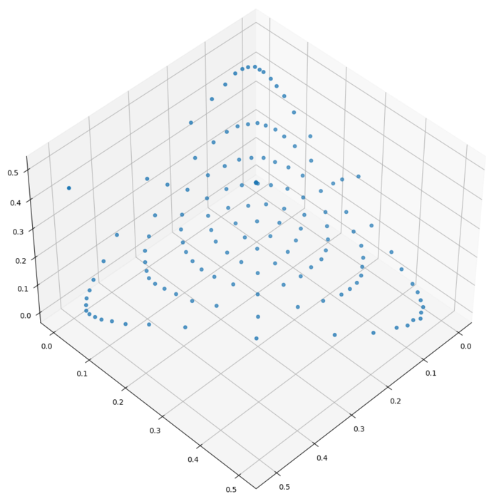
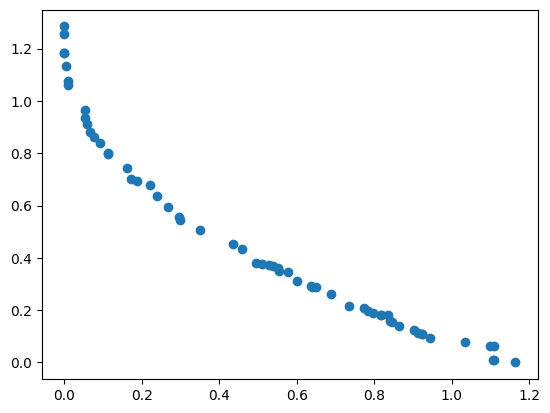

**Organization: [mlpack](https://github.com/mlpack)**

**Project: [Adding NSGA-3 and AGE-MOEA Multi Objective Optimizers](https://summerofcode.withgoogle.com/programs/2024/projects/CIHE5bCy)**

**Mentors: [Marcus Edel](https://github.com/zoq) and [Omar Shrit](https://github.com/shrit)**

Here are the outcomes achieved by the optimizers and test suites I developed this summer.
|  |  |  
|:-------------------------:|:-------------------------:|:-------------------------:|
| NSGA3 On DTLZ1 | AGEMOEA On Fleming | AGEMOEA on ZDT3 |
|  |  | 
| MOEAD On MAF1 | MOEAD On MAF3 | AGEMOEA on ZDT1

## Project Overview.

Multi-objective optimization is crucial across various fields as it enables the balancing of conflicting goals, such as performance versus cost in engineering or profit versus impact in economics. This approach leads to more comprehensive and effective solutions, better suited to complex real-world challenges.

This project aimed to enhance ensmallen's capabilities in multi objective optimization by implementing optimizers such as AGE-MOEA and NSGA-3 and various problems from the MAF Benchmark test suite. 

## Project Objectives

- Implement the AGE-MOEA optimizer algorithm. [Annibale Panichella](https://doi.org/10.1145/3321707.3321839)
- Implement the NSGA-3 optimizer algorithm. [Deb et al., 2013](https://www.egr.msu.edu/~kdeb/papers/k2012009.pdf)
- Implement the MAF benchmark test suite. [Cheng et al., 2017](https://www.researchgate.net/publication/315446832_A_benchmark_test_suite_for_evolutionary_many-objective_optimization)
- Implement the Inverse Generational Distance metric.
- Conduct thorough testing to ensure the reliability and effectiveness of the implemented algorithms.
- Provide comprehensive documentation for the newly added optimizers and test suite.

## Current State of the project.

AGE-MOEA and IGD performance indicator have been fully implemented and merged into the repo along with their respective documentation and tests.

MAF has been fully implemented and tested. Some of the MAF problems have also been added as tests for the optimizers.The PR containing the MAF changes have been approved and are ready to merge.

Simulated Binary Crossover (SBX) has been implemented as a part of the AGEMOEA implementation PR and Hyperplane Normalization has been implemented as a separate class in the NSGA-3 implementation PR.

NSGA-3 has been implemented but needs to undergo testing and further investigation regarding its slow convergence to the true Pareto front.

## Challenges
There were serveral challenges faced throughout all stages of this project: 

**Debugging Complexity:** Debugging these optimizers turned out to be the biggest challenge faced during the whole project.With many moving parts in each optimizer it required thorough code walkthroughs and testing to debug any errors or discrepancies in the output.

**Validating Output with reference implementations:** Each algorithm had various ways to implement some of the components, and the results of other libraries depended on which variation of the components was implemented.

## Future Enhancements and Direction

Looking ahead, there are a few areas that could further enhance the project:

**Improve the runtime of the optimizers:** There are various area in which the runtime of the multiobjective optimizers can be improved leading to more usability(The initial step for this would be to benchmark all the algorithms on a common set of problems).

**Abstracting the offspring generation and selection procedure:** This allows for easy testing of custom or different offspring generation and selection procedures.

## Acknowledgements

I would like to thank the mlpack community especially my mentors [Marcus Edel](https://github.com/zoq) and [Omar Shrit](https://github.com/shrit).Their expertise and insight helped shape my understanding and the regular code reviews really helped me to stick to the timeline.

